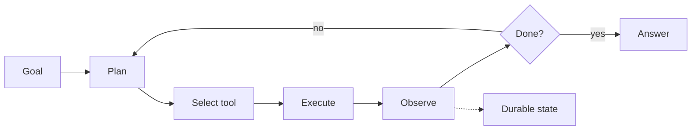

An agent is a loop with tools and memory. The architecture question is not what
goes in the loop — it is what happens when the loop does not terminate.

## The shape

The dotted edge is the one that gets omitted and it is the one that matters. An
agent whose state lives in a Python variable is an agent that loses a
twelve-step task to a deploy.

## Four failure modes

**The loop that will not stop.** Every agent needs a hard step ceiling and a
wall-clock budget, enforced outside the model's judgement. Asking the model to
stop when it is done works until the day it does not, and that day costs a
month of tokens in an afternoon.

**The tool that lies.** A tool returning an error string that looks like a
result will be treated as a result. Tool responses need a machine-readable
success flag, not prose the model has to interpret.

**The context that fills up.** Every turn carries the whole history plus every
tool definition. A long task hits the window and starts silently dropping the
earliest turns — usually the ones containing the actual goal. Summarise
deliberately rather than letting truncation decide.

**The retry that repeats a side effect.** If step four sends an email and step
five fails, retrying from four sends the email twice. Tools with side effects
need idempotency keys, and the agent framework will not add them for you.

## Sizing the bill

Cost scales with steps times tools, not with steps. Tool definitions are
re-sent on every turn, so ten tools over five steps is fifty tool-definition
payloads. The Agent Cost tool counts this properly; a naive estimate is usually
low by more than half.

## What to instrument

Per-step traces with the tool called, the arguments, and the token counts. An
agent that took the wrong action is debuggable; an agent that took the wrong
action three steps ago and you only kept the final answer is not.
