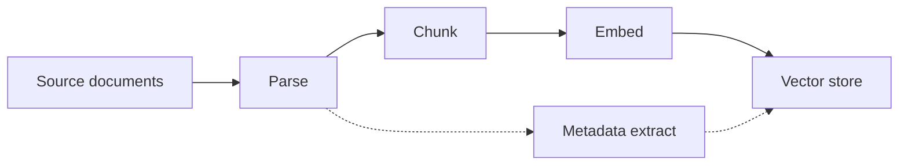
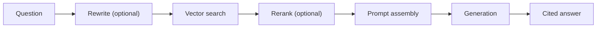

Two paths through a RAG system, and they have opposite constraints. Ingestion
is a batch job that can take minutes. Query is a request that has milliseconds.
Designing them as one pipeline is the most common structural mistake.

## Ingestion

**Parse** is where most quality is won or lost, and it is the stage that gets
the least attention. A PDF parsed as a flat character stream loses tables,
headings, and reading order; every downstream stage then works on text that no
longer means what the document meant.

**Chunk** on structure, not on a character count. See the Chunking Strategy
tool — the difference between a boundary that respects paragraphs and one that
does not is larger than the difference between two vector databases.

**Embed** in batches, and record which model produced each vector. Mixing two
embedding models in one index produces retrieval that is subtly wrong and
impossible to debug from the outside.

## Query

Everything marked optional should stay optional until you have an evaluation
set. Added together on day one, you cannot tell which one earned the
improvement, and you are paying for all of them.

## The one-way doors

| Decision | Reversible? | What it costs to change |
| --- | --- | --- |
| Embedding model | No | Re-embed the entire corpus |
| Embedding dimension | No | Recreate the collection |
| Chunk size and overlap | Painfully | Re-ingest, re-embed |
| Vector database | Yes | Re-index from stored chunks |
| Generation model | Yes | A config change |
| Reranking | Yes | Add or remove a stage |

Keep the parsed chunks in durable storage separate from the vector store. That
one habit turns "change the vector database" from a re-ingestion project into
a re-index, and it costs a table.

## What to instrument

Retrieval quality and generation quality fail differently and need different
fixes, so measure them separately: what fraction of questions retrieved the
right chunk at all, and what fraction of answers used what was retrieved. A
single end-to-end score hides which half is broken.
