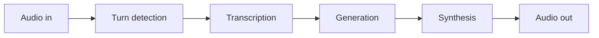

Everything in a voice system is downstream of one number: the pause a caller
will tolerate before the system feels broken. That is roughly 500 ms, and the
naive pipeline spends it twice over.

## The pipeline and its budget

| Stage | Naive | Achievable | How |
| --- | --- | --- | --- |
| Turn detection | 300 ms | 100 ms | Semantic endpointing, not silence timeout |
| Transcription | 400 ms | 80 ms | Streaming ASR on partial audio |
| Generation | 600 ms | 150 ms | Small model, prompt cached, streamed |
| Synthesis | 400 ms | 120 ms | Streaming TTS, first chunk only |
| **Total** | **1,700 ms** | **450 ms** | |

The naive column is what you get by calling four APIs in sequence and waiting
for each. Nothing in it is wrong; it is simply four full round trips.

## Where the time comes back

**Overlap the stages.** Transcription starts on partial audio, generation
starts on the partial transcript once endpointing is confident, and synthesis
starts on the first sentence rather than the full answer. The stages run
concurrently, so the budget is the longest stage plus its handoffs, not the sum.

**Endpoint semantically.** A fixed silence timeout is a direct tax: 300 ms of
waiting on every turn to find out the caller stopped. A model that predicts
turn completion from the partial transcript cuts most of it.

**Cache the system prompt.** It is identical on every turn and it is usually
the largest part of the input. Prompt caching turns it from a per-turn cost in
both money and latency into a near-free prefix.

**Speak first, retrieve second.** If retrieval is needed, an acknowledgement
while the search runs is the difference between a pause and a conversation.

## What breaks in production

**Barge-in.** A caller interrupting mid-sentence has to stop synthesis, discard
the in-flight generation, and re-open the microphone. Retrofitting this is
painful; design the cancellation path from the start.

**Cold starts.** The first call after a scale-up pays for model loading. Keep a
warm floor, and accept paying for idle capacity — the alternative is that your
first caller of the morning is the one who gets the broken experience.
